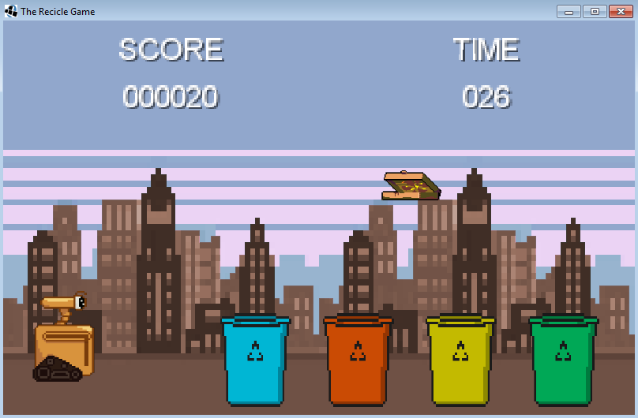

<<<<<<< HEAD
# Recicle Game :recycle:

Este trabalho foi desenvolvido devido a APS (Atividade Prática Supervisionada) proposta aos alunos do terceiro semestre de Ciência da Computação da UNIP (Universidade Paulista). O objetivo é desenvolver um jogo sobre sustentabilidade utilizando a linguagem de programação Java.

O jogo, que foi desenvolvido utilizando o framework [LibGdx](https://libgdx.badlogicgames.com) e a IDE [Android Studio](https://developer.android.com/studio), consiste em controlar o braço de um robô para arremessar diferentes tipos de materiais recicláveis em sua respectiva lixeira, o desafio é obter a maior pontuação antes que o tempo acabe.

=======
# Recicle Game :recycle:

Este trabalho foi desenvolvido devido a APS (Atividade Prática Supervisionada) proposta aos alunos do terceiro semestre de Ciência da Computação da UNIP (Universidade Paulista). O objetivo é desenvolver um jogo sobre sustentabilidade utilizando a linguagem de programação Java.

O jogo, que foi desenvolvido utilizando o framework [LibGdx](https://libgdx.badlogicgames.com) e a IDE [Android Studio](https://developer.android.com/studio), consiste em controlar o braço de um robô para arremessar diferentes tipos de materiais recicláveis em sua respectiva lixeira, o desafio é obter a maior pontuação antes que o tempo acabe.

>>>>>>> 4e11d78003eeaacde5c02f1d1de09edc9dc67f13
A versão completa do código fonte está na pasta [Trabalho_Final_Codigo](LIBGDX/Trabalho_Final_Codigo).